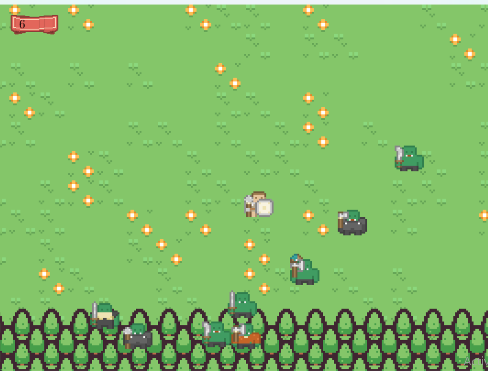

Your character is in the middle of the screen. He will start out naked and unarmed. Find him clothes and weapons
to protect himself and fight the orcs. Your goal is to save the lives of those in the village from the marauding
orcs. The guards will help you while they are still alive but eventually you will be on your own. You score incr-
eases for every orc slain and for every few seconds that you survive. Use the wasd keys or the arrow keys to move
around the map. Hold LSHIFT to sprint. You cannot enter houses or the castle. You can pick up and drop items by 
pressing the TAB key. You attack the orcs with the SPACE key. Give the guards a bit of extra bravery and be sure
to lead them into battle. Press ESCAPE to pauseJust give them a push. Best of luck!

s
